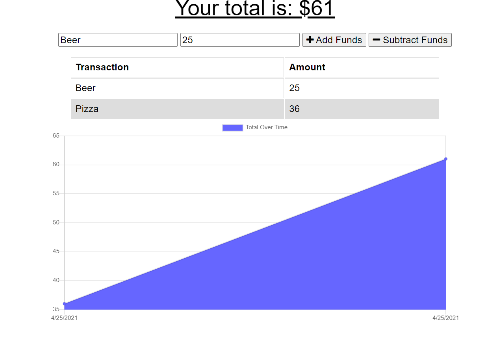

# Budget Tracker PWA
  
### Description: 
This is a progressive web app budget tracker. You can use it on or offline to track your daily expenses.

### Table of Contents:
  - [Description](#description)
  - [Installation](#installation)
  - [Usage](#usage)
  - [Screenshot](#screenshot)
  - [Contributing](#contributing)
  - [Questions](#questions)
  - [License](#license)

### Installation:
Download the repo, npm install dependencies and run it locally.

### Usage:
Tracking day to day expenses, using it to compare spending habits.

### Screenshot:

 
 
GitHib Link: bartok1945@github.com   

### Contributing:
Thom Huenger 
 
GitHub: [bartok1945](http://github.com/bartok1945)  

### Questions:
email Thom at bartok1945@gmail.com 
 
Email me: bartok1945@github.com 
 

### License:

 
This application is covered by MIT. 

